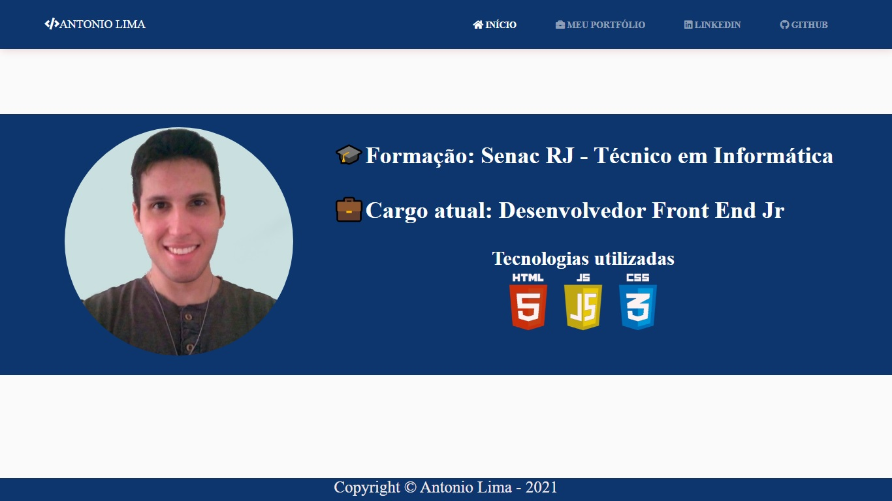
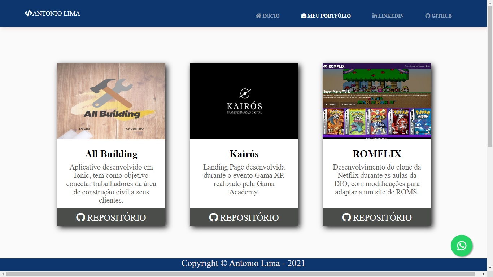
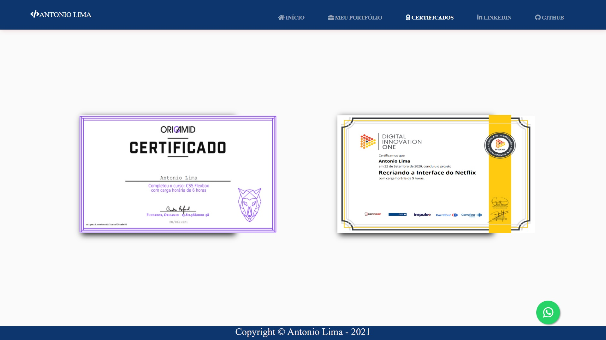
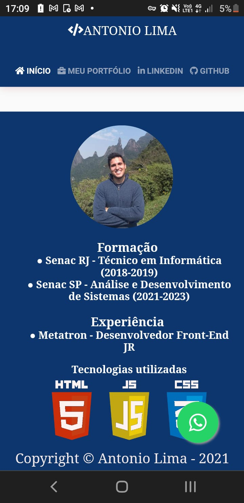

# site-portfolio
Repositório destinado ao meu site pessoal para demonstração de trabalhos realizados.

         

# Desktop - Início:

# Desktop - Meu Portfólio:

# Desktop - Certificados:

# Mobile - Meu Portifólio:

